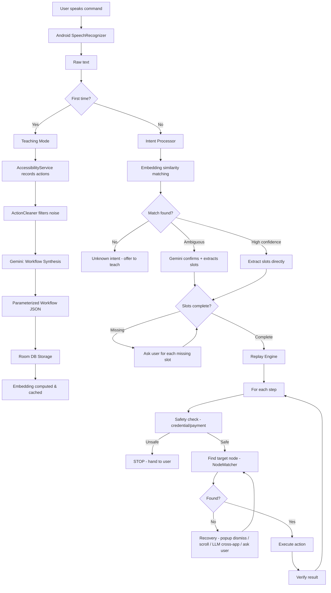

# Architecture

## Components
- **VoiceManager**: Handles voice recognition and command extraction.
- **IntentProcessor**: Determines intent from spoken text.
- **ReplayEngine**: Executes parameterized workflows step by step.
- **TeachingCoordinator**: Orchestrates recording user actions.
- **WorkflowSynthesizer**: Processes and structures learned workflows.
- **ActionCleaner**: Filters out noise and unnecessary actions from recordings.
- **NodeMatcher**: Finds target UI elements during execution.
- **SafetyDetector**: Ensures safe execution (stops at credentials/payments).
- **RecoveryManager**: Handles unexpected UI states (dismiss popups, scroll).
- **ClarificationManager**: Asks user for missing slots or confirmation.
- **CrossAppMapper**: Translates concepts across applications.

## Data Flow
- **Teaching Flow**: User intent -> Record actions -> Clean -> Synthesize -> Store -> Compute Embedding.
- **Replay Flow**: User intent -> Match embedding -> Extract slots -> Clarify (if needed) -> Replay Engine -> Safety check -> Node match -> Execute -> Verify.

## Technology Stack
- **Platform**: Android
- **Language**: Kotlin
- **UI**: Jetpack Compose
- **Database**: Room DB
- **AI/ML**: Gemini API (multi-provider: Groq → OpenRouter → Gemini)
- **Core System**: Accessibility Service

## Key Design Decisions
- **Accessibility Service**: Used for broad and systemic capability to read UI and perform actions.
- **Embedding Similarity + LLM Fallback**: Efficient and accurate matching of natural language to known actions.
- **Generic UI Patterns**: Prefer generic patterns over hardcoded selectors to increase robustness to app updates.
- **Safety Boundaries**: Crucial stop-points for sensitive actions like payments or credential entry to maintain user trust and security.
